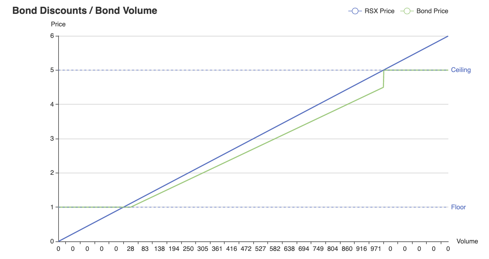
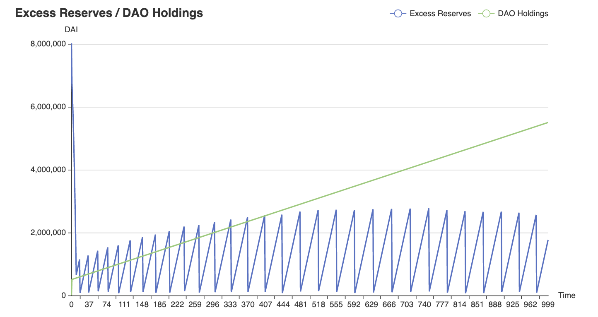
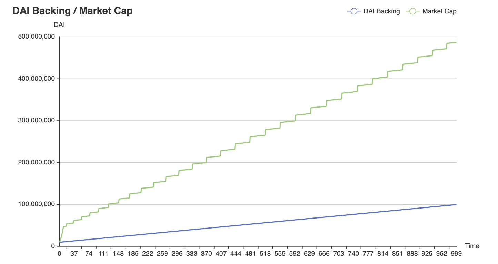
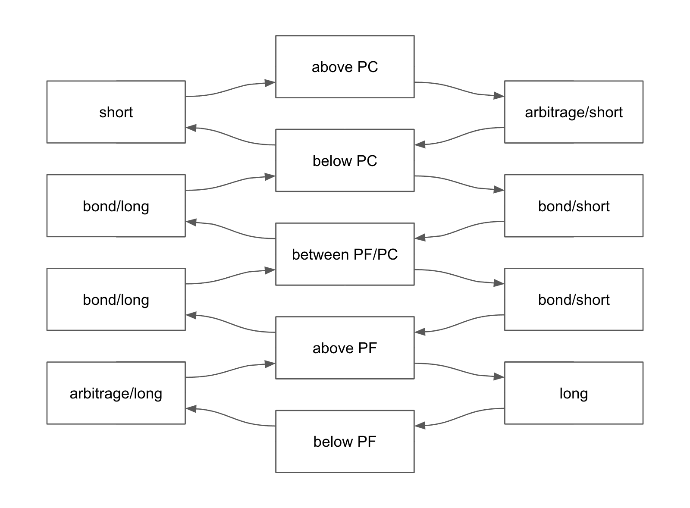

# litepaper

Strategic vision one-pager, version 30th of October 2021.

# Abstract

The Resistance Protocol and its token RSX are designed to promote economical
activity for the benefit of their stakeholders. The Resistance Protocol and RSX
are the next steps in the evolution of three major concepts originally developed
by OlympusDAO. These concepts are Deferred Bond Discounts (DBD), Protocol Owned
Liquidity (POL) and Risk Free Value (RFV). The goal of the Resistance Protocol
and RSX is to provide stakeholders with less risk, easier use and more capital
efficiency operating within its ecosystem.

# Risk Free Value

The Resistance Protocol is designed to let RSX never be cheaper than Price Floor
(PF). While RSX may trade below PF an arbitrage opportunity opens up. In this
case the arbitrageur may buy RSX from the pool below PF and sell RSX to the
protocol at PF. The arbitrage brings RSX back to PF. That way RSX provides
opportunity for stakeholders while ensuring the lower bound of its trading
range. Nobody ever has to sell RSX for less than PF.

The Resistance Protocol is designed to let RSX never be more expensive than
Price Ceiling (PC). While RSX may trade above PC an arbitrage opportunity opens
up. In this case the arbitrageur may buy RSX from the protocol at PC and sell
RSX to the pool above PC. The arbitrage brings RSX back to PC. That way RSX
provides opportunity for stakeholders while ensuring the upper bound of its
trading range. Nobody ever has to buy RSX for more than PC.

The Resistance Protocol is designed to take in any RSX excess supply at PF and
give out any RSX excess demand at PC. Since any RSX in circulation was initially
minted at a multiple of its backing cost, any RSX taken out of circulation at PF
reduces the treasury's burden of backing while increasing its relative excess
reserves. Conversely any RSX sold by the Resistance Protocol at PC increases
excess reserves more than circulating supply due to the Monetary Premium (MP) of
backing at PF.

The Resistance Protocol is designed to let RFV appreciate over time. That means
PF and PC will increase together as long as the treasury owns the required
excess reserves to ensure RFV for the outstanding RSX circulating supply. At
some point it will become unattainable to further increaste PF and PC, simply
because it will take longer and longer to do so. The Resistance Protocol will
algorithmically prevent increasing the PF around a RFV multiple of around 20x.
At this point PF should be kept stable at 10 DAI and all further excess reserves
are diverted as [protocol revenue streams](#protocol-revenue-streams) for the
DAO treasury and the innovation fund. The described design has the following
benefits.

- RSX is always guaranteed to be redeemable for RFV at PF without any slippage
  or market impact.
- RSX is always guaranteed to be available for a MP at PC without any slippage
  or market impact.
- RFV for RSX can only go up, but never down.
- The trading range between PF and PC offers opportunities and promotes economic
  activity at all times.
- Excess demand can never increase stakeholder risk beyond the verifiable PC/PF
  multiple.

Below a simulation of RFV considering PF and PC. The economical model assumes an
initial PF of 0.10 DAI. PC has a MP of 500% at all times, that is an initial PC
of 0.50 DAI. The economical model assumes an initial capital inflow of 10M after
launch at the initial PC. The step function of the economical model simulates
100k capital inflow per time unit. The economical model simulates 1000 of these
time unit iterations resulting in a total of 100M capital inflow simulated. The
dashed yellow line along the x-axis represents the point of break even of the
initial 10M capital invested after launch. That is, everyone having invested at
launch is guaranteed to receive at least RFV for their initial position after
roughly 4M additional capital inflow after launch. The solid yellow line between
PF and PC shows the achieved RFV multiple for the first 10M invested after
launch. The economical model predicts a 5x on RFV at PF for the first 10M
invested after launch, once 100M in total have been flowing into the system.
Note that at this point the achieved multiple would be around 25x at PC. The
economical model assumes a PF growth rate of initially 20%. The initial growth
rate reduces by 5% after each PF increase until a final growth rate of 1% is
reached. Note that 10% of all capital inflow is deducted as [protocol revenue
streams](#protocol-revenue-streams) for the DAO treasury and the innovation
fund.

# Deferred Bond Discounts

The Resistance Protocol is designed to sell reserve bonds at a demand based
discount as long as the discounted RSX price is above PF and below PC. That
means no bonds are sold below PF nor above PC, because at these levels the
Resistance Protocol enables "floor and ceiling peg arbitrage". The vesting term
for Resistance Protocol bonds may be about 7 days, during which the discounted
RSX vests linearly. Bond volume will be determined on a time unit basis. For
instance the maximum bond volume right below PC might be 1k per minute, which
would result in 1.44M available bond volume per day. Should available bond
volume be bought up, then no more bonds can sell until the next time window
opens up new bond volume. The described design has the following benefits.

- The volume per time unit dynamic makes Resistance Protocol bonds easy to
  manage and automates governance.
- The simple design of Resistance Protocol bonds enables changes in bond volume
  to have immediate effects.
- The dynamic bond volume scaling along bond discounts restricts the secondary
  market in a deterministic way.

Below a simulation of DBD. The economical model assumes a PF of 1 and a PC of 5.
The economical model assumes a static discount of 10% for educational purposes
within this paper. The solid green line shows the effective discount in relation
to the solid blue line representing the RSX price. The economical model shows
that discounts never yield below PF nor above PC. Further we can see how volume
per time unit scales linearly along the RSX price curve on the x-axis. Bond
volume reduces to 0% per time unit towards PF and increases to 100% per time
unit towards PC, all the while respecting boundaries of PF and PC each.

# Protocol Owned Liquidity

The Resistance Protocol is designed to acquire and retain POL in perpetuity. The
market for RSX will be built to be volatile within the trading range defined by
PF and PC. Multiple smaller pools should be created at the start so that the
protocol can earn trading fees based on arbitrage between these different pools.
RSX will always be minted against and be backed by a given RFV per asset. DAI,
FRAX and LUSD will have a RFV of 1. Euro stables may have a dynamic RFV of 1.15
in the future. Volatile assets like ETH and OHM may receive their own RFV upon
on chain governance. Since volatile assets have to be heavily discounted, they
are more capital inefficient and will therefore not be acquired by the protocol
at launch. Once the Resistance Protocol got bootstrapped volatile assets may be
voted in via on chain governance so they may contribute more greatly to trading
fees earned due to their volatile nature.

The Resistance Protocol is designed to introduce friction into the market where
earning more from trading fees is required. Given 4 different liquidity pools,
the Resistance Protocol can periodically buy from and sell to 1 of the available
pools using minted RSX in order to create an imbalance in one place. This
imbalance should then be taken advatange of by arbitrageurs, effectively
producing trading fees earned by the protocol. While introducing this friction
in one place causes costs, harnessing trading fees produced by this imbalance
from three other places should not only offset the initial cost, but also yield
a net positive for the treasury.

The Resistance Protocol is designed to acquire and retain POL by exclusively
selling reserve bonds. Stakeholders bring e.g. DAI and get e.g. discounted RSX.
The bonded DAI will be matched by the protocol minting RSX in order to add most
of the treasury's backing as liquidity to the protocol owned pools. Should
backing be required by users, then liquidity is removed programmatically on
demand from the protocol owned pools, to the extend of RSX being redeemed. The
described design has the following benefits.

- All of the RFV backing RSX, minus an operational buffer, will be utilized for
  POL, making the protocol most capital efficient.
- All RSX within the protocol owned pools is dynamically minted against the RFV
  provided by stakeholders, making the protocol most capital efficient.
- All of the POL is backing RSX at RFV at a capital efficiency of 100%. No
  liquidity has to be discounted for backing RSX.

# Non-Custodial Design

The Resistance Protocol is designed to be non-custodial. That means RSX tokens
of stakeholders will never be held by the protocol's smart contracts in order
for stakeholders to benefit from economical activity. The protocol's smart
contracts will only ever hold RFV backing RSX, plus on chain governed excess
reserves. RSX will not be a rebasing token, nor does the system rely on staking.
There will be no liquidity mining incentives and no rewards will be given out
for rent seeking behaviour. RSX can simply be held in stakeholder addresses
without ever having to rely on third party custody. Contract interactions may
only be required for buying and selling RSX, or for relevant on chain governance
that stakeholders themselves decide to engage in. In most cases RSX
stakerholders do not need to do more than holding spot and waiting for e.g. RFV
appreciation built into the system. Note that on chain coordination games like
[0xtowers/litepaper](https://github.com/0xtowers/litepaper) may require
stakeholders to give custody of their RSX tokens to these kind of smart
contracts, if stakeholders choose to play these games.

# On Chain Governance

The Resistance Protocol is designed to be governance minimized. Any required
decisions for substantial protocol changes should be voted and executed upon on
chain without any intermediary having to finally execute upon decisions. A gauge
like voting system may be provided in which RSX holders will approve or deny any
changes proposed. A guardian multisig will be put in place to forbid critical
changes potentially putting the system at risk of failure during the
bootstrapping period. Decisions that may have to be made include, but are not
limited to the following areas.

- Adding and removing reserve assets, including their RFV and allocation
  targets. Implications of adding reserve assets is to sell bonds for them. E.g.
  adding DAI as reserve asset implies to sell DAI bonds, have RSX/DAI POL and
  make RSX redeemable for DAI at PF. Requires majority vote on chain.
- Changing bond volume per time unit. Implications of changing bond volume is to
  sell more or less bonds, eventually showing reflexive results relative to
  current market conditions. Requires majority vote on chain.
- Increasing PF and PC. Implications of increasing PF is for RSX to never be
  cheaper than PF ever again. Available for anyone to execute as soon as the
  system guarantees full backing at the new level.

Below a simulation of excess reserves pepetuated by the [Infinite Flywheel
Effect](#infinite-flywheel-effect). The economical model assumes properties as
described in the sections [Risk Free Value](#risk-free-value) and [Deferred Bond
Discounts](#deferred-bond-discounts). Based on an initial 10M capital inflow at
launch the protocol's excess reserves start out to be relatively high and get
used up to increase PF relatively quickly. Moving forward the economical model
shows how excess reserves go up and down over time. Excess reserves increasing
means the protocol accumulates the necessary funding of backing all outstanding
RSX circulating supply at the next level of PF. Once the system obtained enough
excess reserves anyone can trigger the algorythmically defined PF increase. Once
the system increased the PF it can never go lower again anymore since all
treasury capital is locked for backing RSX at this point. Increasing PF depletes
excess reserves and a new cycle of excess reserve accumulation begins to lift
the PF again as soon as sufficient excess reserves accumulated. The model does
also show DAO holdings over time for comparision. More information on DAO
holdings can be found in [Protocol Revenue Streams](#protocol-revenue-streams).

# Zero Knowledge Rollup

The Resistance Protocol and its on chain coordination games should be delpoyed
on a zero knowledge rollup like [zksync](https://zksync.io). Its security and
performance guarantees are perfectly suited for user facing protocols
considering current cost of operation on Ethereum mainnet.

# Protocol Revenue Streams

The Resistance Protocol is designed to divert 10% of all capital inflow for
operational expenses and future developments. Therefore 5% of all capital inflow
will be diverted to the DAO treasury multisig intended to strategically
compensate contributors. Furthermore 5% of all capital inflow will be diverted
to an innovation fund multisig intended to strategically invest in paradigm
shifting technologies. Note that the innovation fund will operate autonomously
and investments may or may not be related to the Resistance Protocol ecosystem.
Revenue streams captured are listed below.

- Especially early on the main revenue stream will be based on the MP earned
  from bonding, as well as from floor and ceiling peg arbitrage. The vast amount
  of treasury assets should come from this kind of MP.
- Over time trading fees coming from POL should become a secondary driver of
  treasury value accrual. This will be possible by deploying treasury assets
  which are backing RSX into RSX related LP positions.
- Once established, some excess reserves should be deployed in risk minimized
  strategies helping the treasury earn more while growing excess reserves for
  stakeholders.
- A potential economical driver for RSX value accrual will be on chain
  coordination games like
  [0xtowers/litepaper](https://github.com/0xtowers/litepaper). These
  coordination games will be part of the Resistance Protocol ecosystem and will
  only be playable using RSX or its LP positions. There are two benefits to this
  dynamic. First, these kind of on chain coordination games will drive demand
  for RSX and act as a supply sink. Second, 5% of capital inflow into these kind
  of on chain coordination games will be captured by the innovation fund. Since
  the captured capital will be denominated in RSX, the innovation fund will
  programmatically redeem RSX at PF and thus reduce circulating supply while
  increasing relative backing of RSX.

Below a simulation of DAI backing in relation to market cap pepetuated by the
[Infinite Flywheel Effect](#infinite-flywheel-effect). The economical model
assumes properties as described in the sections [Risk Free
Value](#risk-free-value) and [Deferred Bond
Discounts](#deferred-bond-discounts). Reserve assets backing outstanding RSX
circulating supply increase linearly with capital inflow, minus the 10% diverted
for DAO treasury and the innovation fund. Since PF and PC increase over time
market cap grows proportionally. The economical model described arrives at below
500M market cap given 100M gradual capital inflow and 10M initial capital inflow
at launch.

# Infinite Flywheel Effect

The Resistance Protocol and its token RSX are designed to be unstopple as soon
as its infinite flywheel effect got initiated. RSX is forced to always move
within its algorithmically defined trading range. This trading range has a lower
and an upper bound. The lower bound is determined by the PF. The upper bound is
determined by the PC.

RSX moving below PF implies increasing RFV by removing RSX supply that would
otherwise have to be backed extensively by the treasury. RSX trading below PF is
good for the treasury's capital efficiency and therefore in last consequence
good for stakeholders. RSX trading below PF provides tremendous opportunities
for arbitrageurs to bring RSX back to PF. The dominant strategy for RSX trading
below or near PF is to long RSX, perpetuating the infinite flyhweel effect
further.

RSX moving inbetween PF and PC implies increasing RFV by selling bonds for e.g.
DAI at a discounted MP on top of PF. That means the treasury increases excess
reserves later used to raise the PF. RSX trading between PF and PC is good for
the treasury's capital efficiency and therefore in last consequence good for
stakeholders. RSX trading between PF and PC provides tremendous opportunities
for bonders to benefit from the available bond volume. The dominant
strategy for RSX trading between PF and PC is to bond e.g. DAI for RSX,
perpetuating the infinite flyhweel effect further.

RSX moving above PC implies increasing RFV by selling RSX into the market for
e.g. DAI. RSX trading above PC is good for the treasury's capital efficiency and
therefore in last consequence good for stakeholders. RSX trading above PC
provides tremendous opportunities for arbitrageurs to bring RSX back to PC. The
dominant strategy for RSX trading above or near PC is to short RSX, perpetuating
the infinite flyhweel effect further.

# Initial Network State

Following is a list of properties suggested for the initial network state at
launch.

- The initial PF will be 0.10 DAI. The initial PC will be 0.50 DAI. The final PF
  will be 10 DAI. The final PC will be 50 DAI.
- The constant MP for PC on top of PF will be 5x.
- The initial PF growth rate will be 20%. The PF growth rate will continuously
  reduce by 5%. The final PF growth rate will be 1%.DAO treasury
- The DAO treasury will receive 5% of all capital inflow until the final PF got
  reached. Once the final PF got reached the DAO treasury will receive 50% of
  all capital inflow.
- The innovation fund will receive 5% of all capital inflow until the final PF
  got reached. Once the final PF got reached the innovation fund will receive
  50% of all capital inflow.
- The initial bond discount will be 5%. The initial vesting term will be 7 days.
  The initial bond volume will be 400 DAI per minute, meaning 576k per day at
  100% bond volume right below PC. The initial max payout per bond will be a
  static 100k.
- The liquidity pairs for RSX pools at launch will include several stablecoins.
- There will be a whitelist system in place at launch.
- There will not be any founder nor team tokens. There will be an option for a
  non-diluting seed investment in form of fRSX (funding-RSX). Seed investment is
  not necessary for Resistance Protocol to be bootstrapped in first place.
  Though if seed investment is taken, fRSX will be minted to the extend of a
  mutual agreement. fRSX will then vest along RSX total supply and will always
  be redeemable at current PF. The protocol will therefore be bootstrapped by
  the community, plus optional seed investment, without accruing any protocol
  debt and without dilluting stakeholders.
- The first coordination game within the Resistance Protocol ecosystem will be
  [0xtowers/litepaper](https://github.com/0xtowers/litepaper). The game will be
  ready to play for whitelisted stakeholders at launch.

# Glossary

- **DAI**, a US Dollar pegged stablecoin
- **DBD**, deferred bond discounts, a futures contract selling discounted RSX
  over time for reserve assets
- **MP**, monetary premium, the amount of money paid on top of risk free value
- **PC**, price ceiling, the lower bound of the RSX trading range
- **PF**, price floor, the upper bound of the RSX trading range
- **POL**, protocol owned liquidity, the liquidity owned by the protocol
- **RFV**, risk free value, the amount of reserve assets guaranteed to be
  redeemable for RSX
- **RSX**, the native token of the Resistance Protocol

# Credits

The vision for Resistance Protocol could never have developed without the
ambitions of OlympusDAO showcasing a succesful implementation of the core
concepts described in this paper. Further there have been countless contributors
within the DAO who inspired, encouraged and supported these efforts along the
ideation phase. There is no Resistance Protocol without OlympusDAO.

The economical models visualized in this paper have been simulated during
countless iterations using [xh3b4sd/rsx](https://github.com/xh3b4sd/rsx). code
history and failed attempts can be reviewed on Github. All graphs are rendered
using [go-echarts/go-echarts](https://github.com/go-echarts/go-echarts). Most of
the

The introduction of a brand new category of on chain coordination games like
[0xtowers/litepaper](https://github.com/0xtowers/litepaper) is a novel
innovation developed to experiment with game theory, capital coordination,
economical productivity and fee sharing structures.

The innovation fund bootstrapped within the Resistance Protocol ecosystem is to
move forward and give back. The most ambitious projects around the most pressing
issues of our time are underfunded. While non of this here could ever have
happened without the great technological advances we all operate on, the
innovation fund seeks to spearhead and backpropagate autonomously without any
restrictions to better the trajectory of our civilization.

A hand full of degens have helped tremendously during early development of smart
contracts and their simulations. Without these kinds of educational,
inspirational, technical and moral support this paper could not have been
written in the first place.
