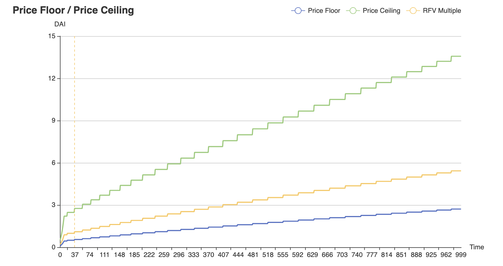

# litepaper

Strategic vision one-pager, version 30th of October 2021.

# Abstract

The Resistance Protocol and its token RSX are designed to promote economical
activity for the benefit of their stakeholders. Resistance and RSX are the next
steps in the evolution of three major concepts originally developed by
OlympusDAO. These concepts are Deferred Bond Discounts (DBD), Protocol Owned
Liquidity (POL) and Risk Free Value (RFV). The goal of Resistance and RSX is to
provide their stakeholders with less risk, easier use and more capital
efficiency operating within its ecosystem.

# Risk Free Value

The Resistance Protocol is designed to let RSX never be cheaper than Price Floor
(PF). While RSX may trade below PF an arbitrage opportunity opens up. In this
case the arbitrageur may buy RSX from the pool below PF and sell RSX to the
protocol at PF. The arbitrage brings RSX back to PF. That way RSX provides
opportunity for stakeholders while ensuring the lower bound of its trading
range.  Nobody has ever have to sell RSX for less than PF.

The Resistance Protocol is designed to let RSX never be more expensive than
Price Ceiling (PC). While RSX may trade above PC an arbitrage opportunity opens
up. In this case the arbitrageur may buy RSX from the protocol at PC and sell
RSX to the pool above PC. The arbitrage brings RSX back to PC. That way RSX
provides opportunity for stakeholders while ensuring the upper bound of its
trading range. Nobody has ever have to buy RSX for more than PC.

The Resistance Protocol is designed to take in any RSX excess supply at PF and
give out any RSX excess demand at PC. Since any RSX in circulation was initially
minted at a multiple of its backing cost, any RSX taken out of circulation at PF
reduces the treasury's burden of backing while increasing its relative excess
reserves.

The Resistance Protocol is designed to let RFV appreciate over time. That means
PF and PC will increase together as long as the treasury owns the required
excess reserves to ensure RFV for the outstanding RSX supply. The described
design has the following benefits.

- RSX is always guaranteed to be redeemable for RFV at PF.
- RFV for RSX can only go up, but never down.
- The trading range between PF and PC offers opportunities and promotes economic
  activity at all times.
- Excess demand can never increase stakeholder risk beyond the PF/PC multiple.

Below a simulation of RFV considering PF and PC. The economical model assumes an
initial PF of 0.10 DAI. PC has a monetary premium of 500% at all times, that is
an initial PC of 0.50 DAI. The economical model assumes an initial capital
inflow of 10M after launch at the initial PC. The step function of the
economical model simulates 100k capital inflow per time unit. The economical
model simulates 1000 of these iterations resulting in a total of 100M capital
inflow simulated. The dashed yellow line along the x-axis represents the point
of break even of the initial 10M capital invested after launch. That is,
everyone having invested at launch is guaranteed to not at least receive RFV for
their initial position after roughly 4M capital inflow from after launch. The
solid yellow line between PF and PC shows the achieved RFV multiple for the
first 10M invested after launch. The economical model predicts a 5x on RFV at PF
for the first 10M invested after launch, once 100M in total have been flowing
into the system. Note that at this point the achieved multiple would be around
25 at PC. The economical model assumes a PF growth rate of initially 20%. The
initial growth rate reduces by 5% after each PF increase until a final growth
rate of 1% is reached. Note that 10% of all capital inflow is deducted as
[protocol revenue streams](#protocol-revenue-streams) for the DAO treasury and
the innovation fund.

# Deferred Bond Discounts

The Resistance Protocol is designed to sell bonds at a simple static discount,
e.g. 5%, as long as the current RSX price is above PF and below PC. That means
no bonds are sold below PF and above PC, because at these levels the Resistance
Protocol enables floor and ceiling peg arbitrage. The vesting term for
Resistance Protocol bonds may be about 7 days, during which RSX vests linearly.
The limiting factor for a healthy supply and demand dynamic will be the bond
capacity at a given RSX price. While the same discount applies regardless the
RSX price, Resistance sells bonds at a determined volume per time unit. For
instance 1k bond volume per minute would result in 1.44M available bond volume
per day. Should available bond volume be bought up, then no more bonds can sell
until the next time window opens up new capacity. The described design has the
following benefits.

- The static discount makes Resistance Protocol bonds easy to understand and
  easy to use for stakeholders.
- The volume per time unit dynamic makes Resistance Protocol bonds easy to
  manage and automates governance.
- The simple design of Resistance Protocol bonds enables changes in bond volume
  to have immediate effects.

Below a simulation of DBD. The economical model assumes a PF of 1 and a PC of 5.
The solid green line shows the effective discount in relation to the solid blue
line representing the RSX price. While the bond discount remains static the
absolute discount in DAI terms reduces linearly along the RSX price up to
boundaries of PF and PC. The economical model shows that discounts never yield
below PF and above PC. Further we can see how volume per time unit scales
linearly along the RSX price curve as well. Bond volume reduces to 0% towards PF
and increases to 100% towards PC, all the while respecting boundaries of PF and
PC each.

# Protocol Owned Liquidity

The Resistance Protocol is designed to acquire and retain POL in perpetuity. The
market for RSX will be built to be volatile within the trading

multiple pools
backing assets
adding and removing RSX against pool to introduce friction and earn more from fees
matching pool pair value by minting
capital efficiency
reserve vs liquidity bonds

# On Chain Governance

governance minimization
on chain voting
beneficiary addresses

# Arbitrum One Rollup

fees
towers

# Protocol Revenue Streams

trading fees
POL
towers
innovation fund

# Infinite Flywheel Effect

The Resistance Protocol and its token RSX are designed designed to be unstopple
as soon as its infinite flywheel effect got initiated. RSX is forced to always
move within its algorithmically defined trading range. This trading range has a
lower and an upper bound. The lower bound is determined by the PF. The upper
bound is determined by the PC.

RSX moving below PF implies increasing RFV by removing RSX supply that would
otherwise have to be backed extensively by the treasury. RSX trading below PF is
good for the treasury's capital efficiency and therefore in last consequence
good for stakeholders. RSX trading below PF provides tremendous opportunities
for arbitrageurs to bring RSX back to PF. The dominant strategy for RSX trading
below or near PF is to long RSX, perpetuating the infinite flyhweel effect
further.

RSX moving inbetween PF and PC implies increasing RFV by selling bonds for e.g.
DAI at a multiple of PF. That means the treasury increases excess reserves later
used to raise the PF. RSX trading between PF and PC is good for the treasury's
capital efficiency and therefore in last consequence good for stakeholders. RSX
trading between PF and PC provides tremendous opportunities for bonders to
benefit from the available bonding capacity. The dominant strategy for RSX
trading between PF and PC is to bond e.g. DAI for RSX, perpetuating the infinite
flyhweel effect further.

RSX moving above PC implies increasing RFV by selling RSX for e.g. DAI at a
multiple of PF. That means the treasury increases excess reserves later used to
raise the PF. RSX trading between PF and PC is good for the treasury's capital
efficiency and therefore in last consequence good for stakeholders. RSX trading
above PC provides tremendous opportunities for arbitrageurs to bring RSX back to
PC. The dominant strategy for RSX trading above or near PC is to short RSX,
perpetuating the infinite flyhweel effect further.

bond volume produces sell preasure to drive RSX price towards PF

# Initial Network State

PF PC multiple eg 5
rising fast early and more slowly later

work the notion of "no slippage" into the litepaper when selling to or buying
from the protocol

DAI
LUSD
FRAX

# Glossary

- **DAI** a US Dollar pegged stablecoin
- **DBD** deferred bond discounts, a futures contract selling discounted RSX over time for reserve assets
- **PC** price ceiling, the lower bound of the RSX trading range
- **PF** price floor, the upper bound of the RSX trading range
- **POL** protocol owned liquidity, the liquidity owned by the protocol
- **RFV** risk free value, the amount of reserve assets guaranteed to be redeemable for RSX
- **RSX** the native token of the Resistance Protocol
